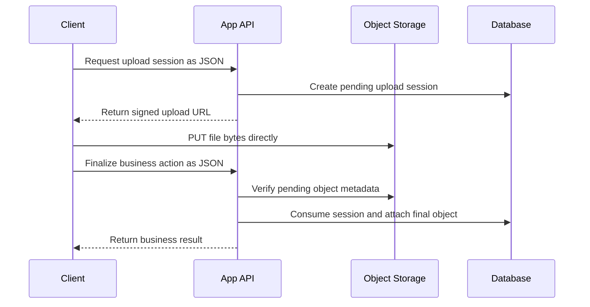

# File Upload Architecture: Control in the App, Bytes in Object Storage

File upload architecture looks simple until the endpoint becomes public.

The first implementation is usually a form. The browser sends
`multipart/form-data` to the application server, the server parses the request,
checks the file size, validates the type, uploads the file to object storage,
and writes metadata to the database.

That works for a prototype. It is not the architecture I want for a production
system that accepts untrusted files.

The better rule is this:

> The application should control the upload, but object storage should carry
> the bytes.

In practice, that means the application authorizes and finalizes uploads
through small JSON requests. The client sends the actual file directly to
object storage through a scoped signed URL.

## Multipart Is Not One Thing

It is important to separate two different uses of the word "multipart."

`multipart/form-data` from a browser to the application server is the pattern I
avoid for production file uploads. It pushes large, attacker-controlled request
bodies through the application before the application has a chance to finish
business validation.

Object-storage multipart upload is different. S3-compatible storage systems can
split a large object into parts and upload those parts directly to storage.
That can be a good design for large files because the application still does
not proxy the bytes.

So the rule is not "multipart is always bad." The rule is narrower:

> Do not make the application server the first place that receives arbitrary
> user file bytes.

## The Failure Mode

The dangerous version usually starts with code that reads like this:

```ts
const form = await request.formData();
const file = form.get("file");
```

The problem is not the two lines of code. The problem is the timing.

Depending on the framework and runtime, the server may buffer the request body
before the application code checks the file size. By the time the handler says
"maximum 10 MB," the process may already have accepted a much larger payload
into memory, temporary files, or internal parser buffers.

That creates a bad security boundary:

- The reverse proxy might allow a larger body than the application expects.
- The application framework may parse the request before business validation.
- File-size checks may happen after memory has already been consumed.
- Every upload competes with normal API traffic for application resources.
- Scaling uploads means scaling app servers, even though the app is not the
  right place to store bytes.

A streaming multipart parser with strict limits is better than full buffering.
It is still an ingestion path through the application server. For public or
high-volume uploads, I prefer removing that path entirely.

## Target Architecture

The target flow has three phases: authorize, upload, finalize.



The application still owns the important decisions:

- Who is allowed to upload
- Which business object the file belongs to
- What file types are accepted
- How large the file may be
- Whether the uploaded object is complete
- When the file becomes part of durable business state

Object storage owns the expensive transfer.

## Upload Session Contract

The upload session is the bridge between the JSON API and object storage. It is
not just a presigned URL wrapper. It is a short-lived permission record.

A useful session record includes:

| Field                 | Purpose                                      |
| --------------------- | -------------------------------------------- |
| `id`                  | Opaque token passed back during finalization |
| `scope`               | The upload use case                          |
| `ownerUserId`         | The authenticated user, if any               |
| `externalClientId`    | The external integration, if any             |
| `targetType`          | The business object type                     |
| `targetId`            | The object this upload may attach to         |
| `pendingObjectKey`    | Temporary storage key                        |
| `originalFileName`    | User-facing filename                         |
| `declaredContentType` | Client-declared MIME type                    |
| `declaredSize`        | Client-declared byte size                    |
| `expiresAt`           | Short expiration window                      |
| `consumedAt`          | One-time-use marker                          |
| `finalObjectKey`      | Durable key after finalization               |

The key design point is target binding. A file uploaded for one project,
dealer, ticket, application, or approval step should not be attachable to
another one. The session should encode that relationship before any bytes are
accepted.

## Pending Is Not Final

I like using a separate object prefix for pending uploads:

```text
pending/project-tracking/<session-id>/<safe-file-name>
pending/approval-attachments/<session-id>/<safe-file-name>
pending/dealer-licenses/<session-id>/<safe-file-name>
```

An object in a pending prefix is not business data yet. It is only evidence
that the client completed a byte transfer.

Finalization is where the application turns that pending object into durable
state:

1. Re-load the upload session.
2. Verify that the caller still has permission.
3. Verify the session is not expired or consumed.
4. Check the object exists in storage.
5. Compare object size and content type against policy.
6. Optionally inspect file signatures for risky formats.
7. Move or copy the object into a final namespace.
8. Persist business metadata in a transaction.
9. Mark the session consumed.

That last step matters. Upload sessions should be one-time-use. If a retry
happens, the server should be able to distinguish a safe idempotent retry from
an attempt to reuse a completed upload for another action.

## Where Body Limits Belong

Once file bytes bypass the app, body limits become simpler.

The application ingress can enforce a small request body limit because app
requests are JSON only. A limit around 1-2 MB is usually enough for normal
metadata payloads, and it blocks accidental or malicious large bodies before
they reach the runtime.

Object storage should have its own upload-size policy. That limit belongs on
the storage ingress, bucket policy, or signed URL workflow, not on the app
server.

The split is clean:

| Layer          | Request type                | Limit strategy                        |
| -------------- | --------------------------- | ------------------------------------- |
| App API        | JSON metadata               | Small body limit                      |
| Upload session | JSON policy request         | Validate declared file size and type  |
| Object storage | File bytes                  | Storage-side max object/upload policy |
| Finalizer      | JSON plus `uploadSessionId` | Verify object metadata before attach  |

If any application endpoint still accepts file bodies, a global small body
limit can break that endpoint. That is a sign that the migration is not done
yet. Finish the upload cutover first, then lower the application limit
confidently.

## Client-Side Upload Progress

Direct upload does not remove upload progress. It moves progress tracking to
the request that actually carries the bytes: the client-to-storage transfer.

For small and medium files, a single signed `PUT` request is enough. For larger
files, storage-native multipart upload lets the client track progress per part
while the app still only coordinates authorization and finalization.

The UI should treat upload progress and business submission as two separate
states:

1. Uploading bytes to storage
2. Finalizing the business action with the app

That distinction makes retries easier. If the byte upload succeeds but
finalization fails, the client can retry the JSON finalization without
re-uploading the file, as long as the session is still valid.

## What the App Must Still Verify

A signed URL is not a substitute for server-side validation. It is only a
temporary permission to write one object.

Before attaching the object to business state, the application should verify:

- The session belongs to the caller or integration
- The session scope matches the endpoint
- The target object still exists and is writable by this caller
- The object exists at the expected pending key
- The stored size is within policy
- The stored content type matches the allowed set
- The filename stored in metadata is safe for display
- The session has not expired or already been consumed

For high-risk uploads, add malware scanning, file signature validation,
quarantine, or asynchronous approval before making the file downloadable.

## Operational Checklist

The architecture is straightforward, but the operational details matter.

Use short signed URL expirations. Keep pending upload sessions temporary. Clean
up expired pending objects on a schedule. Log upload session creation,
finalization, rejection, and cleanup. Make upload sessions single-use. Bind
every session to a scope and target. Keep object keys unguessable. Never trust
client-declared MIME types without finalization checks.

Also add a regression guard. If the goal is to keep file bytes out of the app,
tests or source checks should fail when file upload routes reintroduce
`multipart/form-data` parsing.

The best upload architecture is not only about the happy path. It is about
making the unsafe path hard to reintroduce later.

## Trade-Offs

Direct-to-object-storage upload is not free.

You need CORS configuration. You need upload session state. You need pending
object cleanup. You need a slightly more complex client flow. You need to think
about retries across two network operations instead of one.

Those costs are real, but they are paid in the right place. The application
stays focused on authorization, policy, workflow, and metadata. Object storage
does the large transfer work it was built to do.

For tiny internal tools, app-server multipart may be acceptable for a while if
strict body limits and streaming parsers are in place. For public registration,
customer portals, distributor workflows, approval attachments, or any endpoint
that accepts untrusted files, direct upload should be the default design.

## The Takeaway

File uploads should be designed as a distributed workflow:

- The app controls permission.
- The app issues a scoped upload session.
- The client sends bytes directly to object storage.
- The app verifies and finalizes the object through JSON.
- The app ingress rejects large request bodies by default.

That is the boundary I want in production: control in the application, bytes in
object storage.
