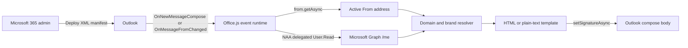

Company-wide email signatures sound simple until one Microsoft 365 user needs
to send mail for two brands.

The employee has one mailbox, a primary address, and one or more aliases. The
signature must appear while the message is being written, use the correct brand
for the selected `From` address, and update immediately when that address
changes. It must also work in Outlook on the web, Windows, and Mac without
asking IT to configure every device by hand.

Commercial signature platforms solve this, but I did not need another
per-mailbox subscription. Microsoft already exposes the required building
blocks through Outlook event-based add-ins:

- `OnNewMessageCompose` runs when a compose window opens.
- `OnMessageFromChanged` runs when the sender changes.
- `from.getAsync()` returns the active SMTP address.
- `setSignatureAsync()` inserts or replaces the signature in the message body.

I used those APIs to build a self-hosted Outlook add-in that selects the right
signature automatically.

> [!NOTE]
> "Free" means **no additional signature-management license**. The add-in still
> assumes an existing Microsoft 365 tenant, an HTTPS host for its static assets,
> and someone willing to maintain the templates and deployment.

## Why Outlook's Default Signature Was Not Enough

Outlook can store a default signature for an account, but an alias is not a
second account. The same mailbox can send as `person@brand-a.example` and
`person@brand-b.example`, while the built-in signature setting still sees one
mailbox identity.

An Exchange mail flow rule is not an equivalent replacement. A transport rule
can append content after the message is sent, but the user cannot see the final
signature while composing. It also cannot provide the immediate experience of
switching `From` and watching the signature change in the editor.

The requirement was client-side behavior:

1. Open a new message and insert the default brand signature.
2. Change `From` to another company alias.
3. Replace the existing signature with that brand's version.
4. Change back and restore the original signature.
5. Leave the message untouched when the address is unrelated or invalid.

Microsoft added `OnMessageFromChanged` in Mailbox requirement set 1.13
specifically for scenarios like account, delegate, shared-mailbox, and alias
changes.

## Architecture

The complete system fits into one event-driven path:



The production host serves only the manifest, HTML runtime, bundled JavaScript,
icons, and a small well-known authorization file. There is no custom profile
API and no database of employee details.

The employee's profile travels directly from Microsoft Graph to the add-in
running inside Outlook.

## React to the Compose Events

The add-in declares two launch events in its XML manifest:

```xml
<LaunchEvent
  Type="OnNewMessageCompose"
  FunctionName="onNewMessageComposeHandler" />
<LaunchEvent
  Type="OnMessageFromChanged"
  FunctionName="onMessageFromChangedHandler" />
```

Both events call the same update path. A ribbon command called **Apply
signature** calls it too, giving users a manual retry without creating a second
implementation.

The handler performs seven operations:

1. Read the current `From` address.
2. Get the signed-in user's Microsoft 365 profile.
3. Resolve a brand from the sender domain.
4. Detect whether the message body is HTML or plain text.
5. Add, reuse, or remove the managed inline logo.
6. Call `setSignatureAsync()` with the matching content type.
7. Signal completion to Outlook.

A simplified version looks like this:

```typescript
async function applySignatureForCurrentFrom() {
  const item = Office.context.mailbox.item;
  const from = await getFromAddress(item);
  const profile = await getSignedInProfile();
  const signature = resolveSignature(from, profile);

  if (!signature) return;

  const bodyType = await getBodyType(item);
  const isHtml = bodyType === Office.CoercionType.Html;

  await synchronizeInlineImage(item, isHtml ? signature : null);
  await setSignature(
    item,
    isHtml ? signature.html : signature.plainText,
    bodyType
  );
}
```

`setSignatureAsync()` is important here. Unlike appending arbitrary HTML to the
body, it understands the signature region: if a signature already exists, the
API replaces it.

## Resolve the Brand from the Active Sender

The selected `From` address decides the brand. It does not decide whose profile
to load.

That distinction matters for aliases. If the signed-in employee changes from a
primary address to an alias, the profile still comes from Microsoft Graph
`/me`. Only the brand template and brand-specific contact field change.

The resolver is intentionally strict:

```typescript
function resolveSignature(fromAddress: string, profile: SignatureProfile) {
  const match = /^[^\s@]+@([^\s@]+)$/.exec(fromAddress.trim().toLowerCase());

  if (!match) return null;

  const domain = match[1];
  if (domain === "brand-a.example") {
    return buildSignature("brand-a", profile);
  }
  if (domain === "brand-b.example") {
    return buildSignature("brand-b", profile);
  }

  return null;
}
```

An unknown domain returns `null`, so the add-in does not overwrite a signature
it does not own. The address comparison is case-insensitive and ignores
surrounding whitespace.

## Read the Profile Directly from Microsoft 365

The add-in uses Microsoft Entra Nested App Authentication (NAA) with delegated
`User.Read` permission. NAA lets an Office add-in obtain a Microsoft Graph token
as a single-page application without a middle-tier authentication server.

The Graph request selects only the required fields:

```http
GET https://graph.microsoft.com/v1.0/me
  ?$select=displayName,jobTitle,businessPhones,mobilePhone,
  faxNumber,onPremisesExtensionAttributes
```

The current profile contract is:

| Signature value        | Microsoft Graph field                               |
| ---------------------- | --------------------------------------------------- |
| Display name           | `displayName`                                       |
| Local-language name    | `onPremisesExtensionAttributes.extensionAttribute1` |
| Job title              | `jobTitle`                                          |
| Company telephone      | First non-empty `businessPhones` value              |
| Primary-brand mobile   | `mobilePhone`                                       |
| Secondary-brand mobile | `faxNumber`, falling back to `mobilePhone`          |

`displayName` is the only required field. Empty optional fields are omitted
instead of producing blank separators or the word `undefined`.

Using `faxNumber` for a second brand's mobile number is an organization-specific
schema choice, not a general recommendation. If fax numbers become necessary,
that value should move to a dedicated extension attribute.

The security boundary stays narrow:

- The browser bundle contains the public Entra application client ID, not a
  client secret.
- The add-in receives delegated `User.Read`, not application-wide directory
  access.
- It reads only the signed-in user's `/me` profile.
- Profile data is not uploaded to the self-hosted web origin.
- Directory values are escaped before being inserted into HTML.

## One Interactive Setup, Then Silent Authentication

An event-based handler must be quiet and short-lived. It cannot open an
interactive sign-in popup in response to a compose event.

The add-in therefore has a **Set up profile** ribbon button. The first time a
user opens that task pane, they select **Sign in and test profile**. The add-in
can complete interactive NAA authentication there and verify that Microsoft
Graph returns a usable profile.

After setup, compose events call `acquireTokenSilent()`. If silent
authentication fails and no cached profile is available, the add-in adds a
small Outlook notification with a **Set up** action instead of interrupting the
message editor.

A successfully loaded profile is stored in Outlook roaming settings for up to
seven days. That cache serves two purposes:

- Temporary Graph or network failures do not remove signatures from normal
  compose flows.
- The user does not need to authenticate again for every message.

Authentication and Graph requests also have short timeouts. A stalled identity
request should not block every later `From` change in the same compose window.

## Support HTML, Plain Text, and Inline Logos

The event handler asks Outlook for the body's coercion type before setting the
signature.

- HTML messages receive the branded HTML template.
- Plain-text messages receive a readable text equivalent.
- Plain text never receives an image attachment.

For a brand that uses a logo, the HTML references an inline PNG by Content-ID.
The event handler adds the base64 image as an inline attachment before setting
the signature.

Switching brands creates a cleanup problem. Without explicit management, every
`From` change could add another copy of the logo. The add-in therefore finds
attachments with its managed filename and applies three rules:

1. Add the image when the target signature needs it and none exists.
2. Keep one copy and remove duplicates.
3. Remove the managed image when switching to a signature without a logo.

The templates stay below the `setSignatureAsync()` limit of 30,000 characters,
and the image bytes remain separate from the signature HTML.

## Serialize Rapid From Changes

Outlook events are asynchronous. A user can change `From` twice before the
first profile lookup and signature update completes.

Running both updates independently creates a race: the older request can finish
last and restore the wrong brand.

I avoid that with one promise queue:

```typescript
let updateQueue: Promise<void> = Promise.resolve();

function queueSignatureUpdate(event: Office.AddinCommands.Event) {
  const current = updateQueue.then(applySignatureForCurrentFrom);

  updateQueue = current.catch((error) => {
    console.error("Unable to update the domain signature.", error);
  });

  void updateQueue.then(() => event.completed());
}
```

Each event re-reads the current sender when its turn begins. Fast alias changes
therefore converge on the most recent `From` value instead of allowing an older
network response to win.

## Deploy It Company-Wide

The add-in uses an add-in-only XML manifest. This format covers Outlook on the
web, new and classic Outlook on Windows, and Outlook on Mac. The manifest
declares:

- Mailbox requirement set 1.13
- `OnNewMessageCompose`
- `OnMessageFromChanged`
- The short-lived event runtime
- Read/write mailbox permission needed to replace the signature
- **Set up profile** and **Apply signature** ribbon commands

The deployment has three parts.

### 1. Host the Static Runtime

Serve the manifest, event bundle, task pane, and icons from an anonymous HTTPS
origin. Event-based activation depends on those resources being reachable
without an interactive web login.

The host also exposes
`/.well-known/microsoft-officeaddins-allowed.json`, which allows the event
runtime to make the authentication and cross-origin requests it needs.

### 2. Register the Entra Application

Create a single-page application registration, add the production
`brk-multihub://` redirect origin, grant delegated `User.Read`, and provide
tenant-wide admin consent so event handlers can authenticate silently.

No client secret is created or shipped.

### 3. Assign the Add-in

In the Microsoft 365 admin center, open **Settings** → **Integrated apps** →
**Upload custom apps**, upload the XML manifest, and assign it to a pilot group.
After validation, expand the assignment to the company.

Users should disable their built-in default Outlook signature before rollout.
Competing signature add-ins can subscribe to the same events, and Microsoft
does not guarantee their execution order.

When the manifest changes, increment its version and upload the new manifest
through Integrated apps. Updating the hosted JavaScript alone does not update
the permissions, commands, events, or URLs already registered in Microsoft 365.

## Client Support and Limits

The add-in targets Exchange Online accounts.

| Client                     | This solution                                     |
| -------------------------- | ------------------------------------------------- |
| Outlook on the web         | Supported                                         |
| New Outlook on Windows     | Supported                                         |
| Classic Outlook on Windows | Supported on current event and NAA-capable builds |
| Outlook on Mac             | Supported with the add-in-only XML manifest       |
| Outlook mobile             | Not deployed for this alias-switching scenario    |

The profile flow requires NestedAppAuth 1.1. Microsoft's documented minimums
include Outlook on Windows Microsoft 365 Version 2409 Build 18025.20000,
Windows retail Version 2501 Build 18429.20132, Windows LTSC Version 2408 Build
17932.20222, and Outlook for Mac 16.89.

Although NAA and parts of event-based activation are available on mobile,
Outlook mobile does not support email aliases for `OnMessageFromChanged`. The
current manifest therefore does not claim mobile support.

Other platform boundaries remain:

- `OnMessageFromChanged` only supports Exchange accounts.
- Alias switching is supported on web, Windows, and Mac, not mobile.
- Event-based activation requires network access to load the runtime.
- Multiple add-ins handling the same event run in an unspecified order.
- An event handler must call `event.completed()` and stay lightweight.
- Unsupported NAA clients can use a recent cached profile, but first-time setup
  requires a compatible client.

## What This Replaces—and What It Does Not

For this company, the add-in replaces the client-side part of a commercial
signature platform:

| Capability                               | Self-hosted add-in |
| ---------------------------------------- | ------------------ |
| Additional per-mailbox signature license | No                 |
| Signature visible while composing        | Yes                |
| Automatic signature on new messages      | Yes                |
| Automatic switching by `From` alias      | Yes                |
| Profile data from Microsoft 365          | Yes                |
| Web, Windows, and Mac                    | Yes                |
| Mobile alias switching                   | No                 |
| Server-side legal enforcement            | No                 |
| Marketing campaign UI and analytics      | No                 |
| Vendor-hosted support and SLA            | No                 |

This approach is a good fit when the organization has a small number of
well-defined brands, already maintains profile data in Microsoft 365, and is
comfortable owning a compact Office.js application.

A commercial platform remains the better choice when the business needs a
non-technical template editor, approval workflows, campaign scheduling,
analytics, guaranteed server-side disclaimers, or vendor support.

## The Result

The final user experience is almost invisible:

1. IT assigns the add-in centrally.
2. The user completes profile setup once.
3. A new message receives the default company signature automatically.
4. Changing `From` to another company alias replaces the signature immediately.
5. The employee can see and edit the final message before sending it.

The key was not reproducing an entire signature-management product. It was
using the Outlook APIs that directly matched the real requirement: react to the
active sender, read the current user's profile, and replace the signature in
the compose window.

That narrow design delivers company-wide, multi-brand Outlook signatures
without adding another per-user subscription.

## References

- [Microsoft sample: Set your signature using Outlook event-based activation](https://learn.microsoft.com/en-us/samples/officedev/office-add-in-samples/outlook-add-in-set-signature/)
- [Automatically update a signature when the From account changes](https://learn.microsoft.com/en-us/office/dev/add-ins/outlook/onmessagefromchanged-onappointmentfromchanged-events)
- [Outlook `From.getAsync()` API](https://learn.microsoft.com/en-us/javascript/api/outlook/office.from)
- [Outlook `setSignatureAsync()` API](https://learn.microsoft.com/en-us/javascript/api/outlook/office.body)
- [Authentication options for Outlook add-ins](https://learn.microsoft.com/en-us/office/dev/add-ins/outlook/authentication)
- [Nested App Authentication requirement set](https://learn.microsoft.com/en-us/javascript/api/requirement-sets/common/nested-app-auth-requirement-sets)
- [Activate Office add-ins with events](https://learn.microsoft.com/en-us/office/dev/add-ins/develop/event-based-activation)
- [Manage add-ins in the Microsoft 365 admin center](https://learn.microsoft.com/en-us/microsoft-365/admin/manage/manage-addins-in-the-admin-center)
